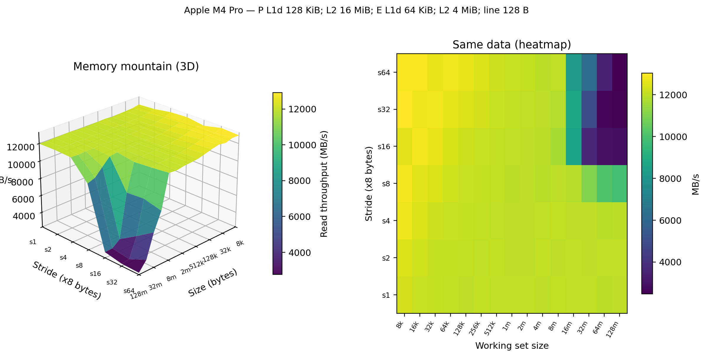

# Memory Mountain

A portable **CSAPP-style memory mountain** microbenchmark: measure read throughput as a function of **working-set size** and **access stride**, then plot a 3D surface and heatmap.

Works on **Linux**, **macOS**, and **Windows** (MinGW / WSL recommended).

<p align="center">
  
</p>

## Requirements

- C++17 compiler (`g++` or `clang++`)
- Python 3 with `matplotlib` and `numpy`

```bash
pip install matplotlib numpy
```

## Quick start

```bash
git clone https://github.com/dolf3131/memory-mountain.git
cd memory-mountain
make all-run          # build → run → detect host → plot
```

Artifacts:

| File | Description |
|------|-------------|
| `output/mountain.csv` | Samples: size, stride, MB/s |
| `output/host_info.json` | Auto-detected CPU / cache summary |
| `output/memory_mountain.png` | 3D surface + heatmap |

## Options

```bash
# Faster / lower-memory sweep
./mountain output/mountain.csv --max-bytes 33554432 --seconds 0.05

# Wider sweep
./mountain output/mountain.csv --min-bytes 4096 --max-bytes 268435456 --max-stride 128

python3 detect_host.py
python3 plot_mountain.py
```

## What you should see

- **Small size + small stride** → high throughput (data fits in cache; good spatial locality).
- **Large size + large stride** → lower throughput (DRAM-bound; prefetch helps less).
- Modern CPUs with aggressive **hardware prefetch** often keep **unit-stride** bandwidth high even for large arrays; the “valley” is clearer at large strides.

Cache labels in the plot title come from `sysctl` (macOS), `/sys/devices/system/cpu/.../cache` (Linux), or a best-effort CPU name (Windows). Missing levels are omitted.

## Repository layout

```
mountain.cpp       # portable C++17 benchmark
detect_host.py     # CPU / cache detection
plot_mountain.py   # matplotlib 3D + heatmap
Makefile           # make all-run
output/            # CSV, host_info.json, figure (example included)
```

## References

1. Randal E. Bryant and David R. O’Hallaron, *Computer Systems: A Programmer’s Perspective*, 3rd ed., Pearson, 2015.  
   — Chapter on the memory hierarchy; the classic “memory mountain” figure and lab inspiration.

2. Randal E. Bryant and David R. O’Hallaron, *CSAPP Student Site* — practice problems and related lab materials:  
   https://csapp.cs.cmu.edu/

3. Ulrich Drepper, “What Every Programmer Should Know About Memory,” 2007.  
   https://people.freebsd.org/~lstewart/articles/cpumemory.pdf  
   — Deeper background on caches, bandwidth, and locality (optional reading).

## Citation

If you use this repository in a report or course project, please cite Bryant & O’Hallaron (CSAPP) as the conceptual source, and optionally this repo for the portable implementation:

```bibtex
@book{bryant2015csapp,
  title     = {Computer Systems: A Programmer's Perspective},
  author    = {Bryant, Randal E. and O'Hallaron, David R.},
  edition   = {3rd},
  year      = {2015},
  publisher = {Pearson},
  address   = {Boston, MA}
}

@misc{memorymountain2026,
  title        = {Memory Mountain: a portable CSAPP-style microbenchmark},
  author       = {Jo, Jeongbin},
  year         = {2026},
  howpublished = {\url{https://github.com/dolf3131/memory-mountain}},
  note         = {GitHub repository}
}
```

## License

MIT — see [LICENSE](LICENSE).
